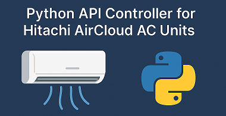
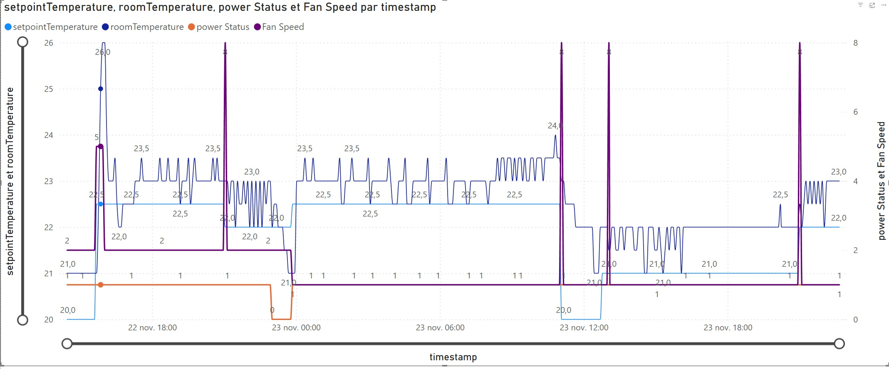

<p align="center">
  
</p>


Python tool to read and control Hitachi AC units that are compatible with the (unofficial) AirCloud Go API, replacing the AirCloud GO App potentially, depending on your usage and objectives:
- Monitor all RACs (power, mode, temperatures, fan, schedule status)
- Read and update weekly timer schedules
- Export RAC status to CSV for Excel / Power BI

I initially created it because I was upset by the fact that when using the Weekly timer/ scheduler based on the schedules defined in the Aircloud App, each time the scheduler changes the settings, the fan moves back systematically to AUTO mode, and overwrites your previous fan speed. This is really painfull.

This is a non official piece of code, with zero guarantee of maintenability, and certainly bugs.
It runs but this is still WIP !

What the program does overall:
-----------------------------
- Reads full unit status for multiple RACs (power, mode, temperatures, fan settings…).
- Fixes unwanted AUTO fan behavior with custom rules: when change to AUTO detected, moves back to your previous fan speed setup.
- Detects any change between 2 measures (temperature, fan, mode…) and logs it.
- Sends commands: ON/OFF, temperature, mode, fan speed, swing.
- Basic functions to manage Weekly Timer schedules (read, update, push). Building blocs for your own logic to be defined.
- Creates a CSV file to then exploit in Excel or PowerBI the informations on RACs
- It uses the API of the official Hitachi Aircloud Go App. To get the weekly timer / scheduler APIs I sniffed the messages exchanged between the AirCloud Go App with an MITM proxy on my personal home network.
- I also tried to see if the Hitachi server could accept 'schedule delete' APIs, because the Aircloud App is not capable of deleting a schedule entry it has created. I dont understand how the developers could miss that fundamental and basic feature... But I couldn'd find a working message (yet), despite trying multiple different queries format to the server. 

## Requirements

- Hitachi AirCloud Go account
- Valid RACs already configured in the official app

- Python 3.10+
- Environment venv, with installed modules:
```requests
websocket-client
python-dotenv
```

You need to create a .env file with:
----------------------------------
HITACHI_USER="your_hitachi_AircloudApp_email"
HITACHI_PASSWORD="your_hitachi_AircloudApp_password"

To Run it:
----------

```
python aircloud.py
```

The script will:
---------------
- authenticate to AirCloud Go
- list all RACs and Weekly timer schedules for each
- check changes in the AC units parameters and current room temperature
- remove fan speed mode AUTO if previously set to a specific speed
- log changes in Data/log.txt and Data/RacsStatus.csv.

Exemples of program logs outputs:
----------------------------------

AC Units / RACs status:

```[ 2025-11-23 22:08:01 ]  = RACs Details =
[ 2025-11-23 22:08:06 ]  Id=12345  - Room1       > Power = OFF  mode = HEATING  fanSpeed = LV3   fanSwing = OFF        roomTemp = 21.0  setpointTemp = 20.0  scheduletype = SCHEDULE_DISABLED
[ 2025-11-23 22:08:06 ]  Id=12346  - Bedroom     > Power = OFF  mode = HEATING  fanSpeed = LV2   fanSwing = OFF        roomTemp = 20.0  setpointTemp = 20.0  scheduletype = WEEKLY_TIMER_ENABLED
```
Schedules list:

```[WEEKLY TIMER for bedroom (4 entries) :
[ 2025-11-23 22:08:06 ]  THU   22:00:00  temp -> 18.5    power ON    HEATING
[ 2025-11-23 22:08:06 ]  THU   22:59:00  temp -> 18.0    power ON    HEATING
```
Detecting updates:

```[ 2025-11-23 21:00:32 ]  >>> Values changed for bedroom :
[ 2025-11-23 21:00:32 ]    - '>>> User or scheduler updated 'fanSpeed' ' : LV1 -> AUTO
[ 2025-11-23 21:00:32 ]  >>> Values changed for Room1 :
[ 2025-11-23 21:00:32 ]    - 'roomTemperature sensor' : 22.0 -> 22.5
[ 2025-11-23 21:00:32 ]  >> FanSpeed AUTO detected on RAC: Bedroom. Forced switch back to LV1
```

CSV lOG file:

```timestamp	    id	    name	power	mode	    fanSpeed	fanSwing	roomTemperature	setpointTemperature	    scheduletype

22/11/2025 14:27	96438	Room1	ON	    HEATING	    LV4	        VERTICAL	22.5	        20.0	                SCHEDULE_DISABLED
22/11/2025 14:27	96442	Bedroom	OFF	    HEATING	    LV2	        OFF	        20.0	        19.5	                WEEKLY_TIMER_ENABLED
```

HOW TO CONTRIBUTE:
-----------------
Contributions are welcome.
Because this project is licensed under CC BY-NC 4.0, all contributions must remain non-commercial and must keep proper attribution.

✔ What you can contribute:

- bug fixes
- improvements to API calls
- support for additional RAC models
- enhanced error handling
- automation rules (custom behaviours)
- improvements to WebSocket/STOMP handling
- documentation updates
- Home Assistant integration experiments

PowerBI view from the CSV generated file:
----------------------------------------
<p align="center">
  
</p>
